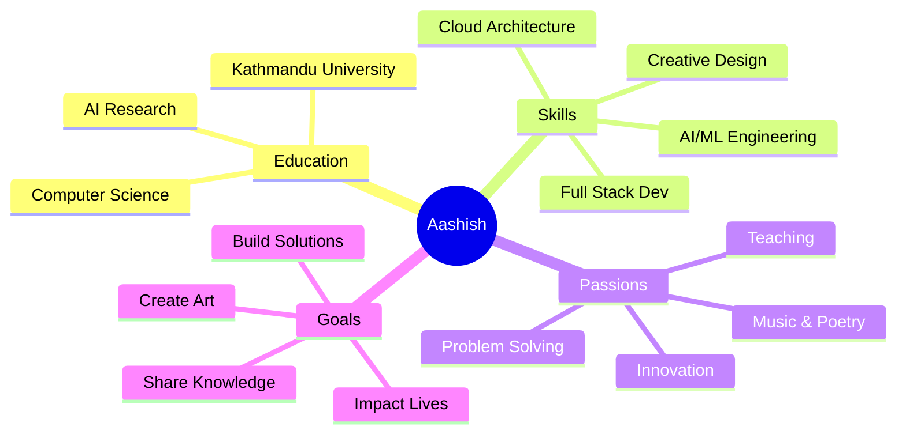

<div align="center">

<!-- Unique 3D Banner -->
<picture>
  <source media="(prefers-color-scheme: dark)" srcset="https://capsule-render.vercel.app/api?type=venom&height=300&text=AASHISH%20THAKURI&fontSize=60&color=gradient&customColorList=27&animation=fadeIn&fontColor=FFFFFF&stroke=00E8FF&strokeWidth=2&desc=Creative%20Developer%20%7C%20AI%20Architect&descSize=25&rotate=5" />
  <source media="(prefers-color-scheme: light)" srcset="https://capsule-render.vercel.app/api?type=venom&height=300&text=AASHISH%20THAKURI&fontSize=60&color=gradient&customColorList=27&animation=fadeIn&fontColor=000000&stroke=00E8FF&strokeWidth=2&desc=Creative%20Developer%20%7C%20AI%20Architect&descSize=25&rotate=5" />
  
</picture>

<!-- Unique Animated Introduction -->


<!-- Unique 3D Profile Card -->
<table align="center">
<tr>
<td>

<h2 align="center">
  
  About Me
</h2>

<div align="center">
  
</div>


```mermaid
mindmap
  root((Aashish))
    Education
      Kathmandu University
      Computer Science
      AI Research
    Skills
      Full Stack Dev
      AI/ML Engineering
      Cloud Architecture
      Creative Design
    Passions
      Innovation
      Teaching
      Problem Solving
      Music & Poetry
    Goals
      Impact Lives
      Build Solutions
      Share Knowledge
      Create Art
```

</td>
</tr>
</table>

<!-- Unique Skills Visualization -->
<table align="center">
<tr>
<td>

<h2 align="center">
  
  Tech Arsenal
</h2>

```python
class TechStack:
    def __init__(self):
        self.languages = {
            "primary": ["Python 🐍", "JavaScript ⚡", "TypeScript 📘"],
            "learning": ["Rust 🦀", "Go 🚀"]
        }
        self.frontend = {
            "frameworks": ["React ⚛️", "Next.js 🔲", "Three.js 🎨"],
            "styling": ["TailwindCSS 🌊", "Framer Motion 🎭"]
        }
        self.backend = {
            "frameworks": ["FastAPI ⚡", "Node.js 🟢", "Express 🚂"],
            "databases": ["MongoDB 🍃", "PostgreSQL 🐘", "Redis ⚡"]
        }
        self.ai_ml = {
            "frameworks": ["TensorFlow 🧠", "PyTorch 🔥", "Scikit-learn 📊"],
            "areas": ["Deep Learning 🤖", "Computer Vision 👁️", "NLP 📝"]
        }
        self.devops = {
            "containers": ["Docker 🐳", "Kubernetes ☸️"],
            "cloud": ["AWS ☁️", "Vercel 🚀", "Firebase 🔥"],
            "tools": ["Git 📚", "GitHub Actions 🔄", "Terraform 🏗️"]
        }

    def get_superpower(self):
        return "Turning Coffee into Code ☕ → 💻"

tech = TechStack()
print(f"Superpower: {tech.get_superpower()}")
```

</td>
</tr>
</table>

<!-- Unique Stats Section -->
<h2 align="center">
  
  GitHub Analytics
</h2>

<p align="center">
  <picture>
    <source media="(prefers-color-scheme: dark)" srcset="https://github-readme-stats.vercel.app/api?username=AashishThakuri&show_icons=true&bg_color=00000000&hide_border=true&text_color=FFFFFF&title_color=00E8FF&icon_color=00E8FF&ring_color=00E8FF" />
    <source media="(prefers-color-scheme: light)" srcset="https://github-readme-stats.vercel.app/api?username=AashishThakuri&show_icons=true&bg_color=00000000&hide_border=true&text_color=000000&title_color=00E8FF&icon_color=00E8FF&ring_color=00E8FF" />
    
  </picture>
  <picture>
    <source media="(prefers-color-scheme: dark)" srcset="https://github-readme-streak-stats.herokuapp.com/?user=AashishThakuri&background=00000000&hide_border=true&stroke=00E8FF&ring=00E8FF&fire=00E8FF&currStreakNum=FFFFFF&sideNums=FFFFFF&currStreakLabel=00E8FF&sideLabels=00E8FF&dates=FFFFFF" />
    <source media="(prefers-color-scheme: light)" srcset="https://github-readme-streak-stats.herokuapp.com/?user=AashishThakuri&background=00000000&hide_border=true&stroke=00E8FF&ring=00E8FF&fire=00E8FF&currStreakNum=000000&sideNums=000000&currStreakLabel=00E8FF&sideLabels=00E8FF&dates=000000" />
    
  </picture>
</p>

<picture>
  <source media="(prefers-color-scheme: dark)" srcset="https://github-readme-activity-graph.vercel.app/graph?username=AashishThakuri&bg_color=00000000&color=FFFFFF&line=00E8FF&point=FFFFFF&area_color=00E8FF&area=true&hide_border=true&custom_title=Contribution%20Graph" />
  <source media="(prefers-color-scheme: light)" srcset="https://github-readme-activity-graph.vercel.app/graph?username=AashishThakuri&bg_color=00000000&color=000000&line=00E8FF&point=000000&area_color=00E8FF&area=true&hide_border=true&custom_title=Contribution%20Graph" />
  
</picture>

<!-- Unique Projects Section -->
<h2 align="center">
  
  Featured Projects
</h2>

<table align="center">
<tr>
<td>

```typescript
interface Project {
  name: string;
  description: string;
  impact: string;
  techStack: string[];
  status: "Active" | "Completed" | "In Progress";
}

const projects: Project[] = [
  {
    name: "🎓 Advance Data Science Classroom",
    description: "Platform democratizing data science education",
    impact: "Empowering students with hands-on AI/ML skills",
    techStack: ["Python", "React", "TensorFlow", "AWS"],
    status: "Active"
  },
  {
    name: "🚀 More Innovations Loading...",
    description: "Exciting projects in development",
    impact: "Stay tuned for more creative solutions",
    techStack: ["Innovation", "Creativity", "Technology"],
    status: "In Progress"
  }
];

// Let's collaborate and build something amazing! ✨
```

</td>
</tr>
</table>

<!-- Unique Connect Section -->
<h2 align="center">
  
  Let's Connect
</h2>

<p align="center">
  <a href="mailto:taashish848@gmail.com">
    
  </a>
  <a href="https://www.linkedin.com/in/aashish-bam-435505351/">
    
  </a>
  <a href="https://aashishh.vercel.app/">
    
  </a>
</p>

<!-- Unique Footer -->
<picture>
  <source media="(prefers-color-scheme: dark)" srcset="https://capsule-render.vercel.app/api?type=shark&height=120&color=gradient&customColorList=27&section=footer" />
  <source media="(prefers-color-scheme: light)" srcset="https://capsule-render.vercel.app/api?type=shark&height=120&color=gradient&customColorList=27&section=footer" />
  
</picture>

<p align="center">
  
</p>

</div>
