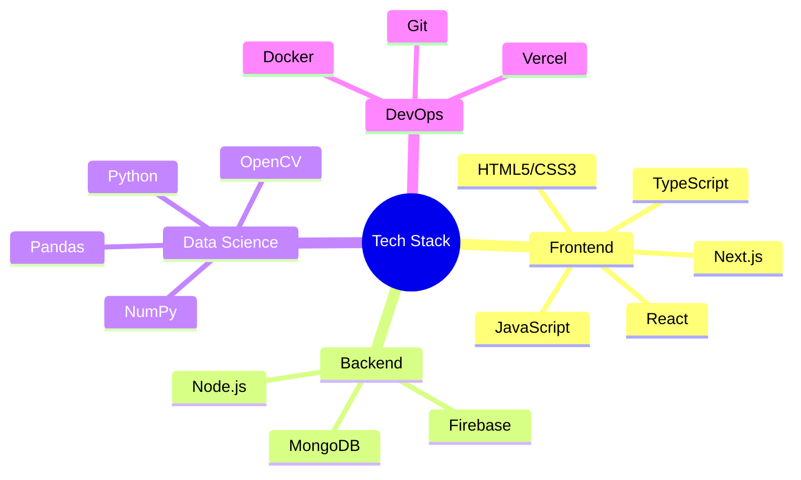

# <div align="center">


<div align="center">
  <a href="https://git.io/typing-svg">
    
  </a>
</div>

<div align="center">
  
</div>

</div>

## 🌟 About Me

```javascript
const aashish = {
    education: "Kathmandu University",
    role: "Student & Tech Innovator",
    passions: ["AI", "Web Development", "Data Science"],
    achievements: {
        founder: "Advance Data Science Classroom",
        impact: "Making data science accessible to KU students",
        mission: "Empowering students through technology"
    },
    creativity: ["Singing", "Poetry", "Guitar"],
    currentFocus: "Building innovative solutions that matter"
};
```

<div align="center">
  
</div>

## 💻 Tech Arsenal & Tools

<div align="center">
  

```mermaid
mindmap
  root((Tech Stack))
    Frontend
      HTML5/CSS3
      JavaScript
      TypeScript
      React
      Next.js
    Backend
      Node.js
      Firebase
      MongoDB
    Data Science
      Python
      NumPy
      Pandas
      OpenCV
    DevOps
      Git
      Vercel
      Docker
```


</div>

## 📈 Contribution Graph

<div align="center">
  <picture>
    <source media="(prefers-color-scheme: dark)" srcset="https://raw.githubusercontent.com/AashishThakuri/AashishThakuri/output/github-contribution-grid-snake-dark.svg" />
    <source media="(prefers-color-scheme: light)" srcset="https://raw.githubusercontent.com/AashishThakuri/AashishThakuri/output/github-contribution-grid-snake.svg" />
    
  </picture>
</div>

## 🏆 GitHub Stats & Achievements

<div align="center">
  
</div>

<div align="center">
  
  
</div>

## 🌐 Connect With Me

<div align="center">
  <a href="mailto:taashish848@gmail.com">
    
  </a>
  <a href="https://www.linkedin.com/in/aashish-bam-435505351/">
    
  </a>
  <a href="https://x.com/Lyrical62785503">
    
  </a>
  <a href="https://aashishh.vercel.app/">
    
  </a>
</div>

<div align="center">
  <h3>💭 Quote of the Day</h3>
  
</div>

---

<div align="center">
  
  
  
  
  **Thanks for visiting! Let's build something amazing together! 🚀**
</div>

<!-- Hidden Section for 3D Render -->
<div id="header-3d" style="position: absolute; top: 0; left: 0; z-index: -1;"></div>
<script type="module" src="assets/js/3d-header.js"></script>
