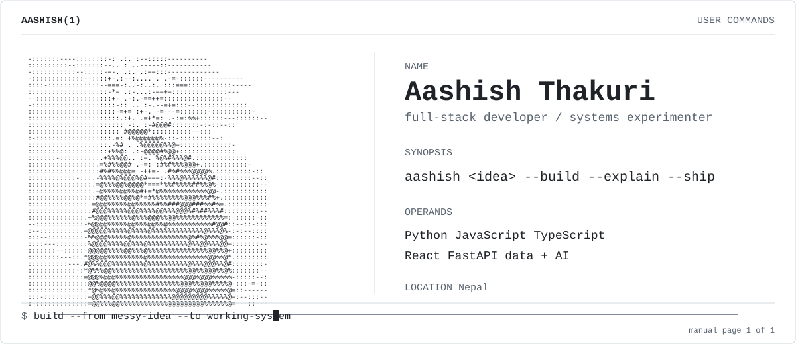

<p align="center">
  
</p>

## `DESCRIPTION`

I am Aashish Thakuri, a developer from Nepal. I build at the intersection of full-stack software, data, AI tools, and visual explanation.

I prefer projects with a visible mechanism: the input is clear, the process can be inspected, and the result can be explained without hiding behind jargon.

## `SELECTED BUILDS`

### [`01  Covid-19-SEIR-Model`](https://github.com/AashishThakuri/Covid-19-SEIR-Model)

An initial-value SEIR simulation of two Nepal COVID-19 waves. It fits ten time-varying transmission segments per wave, advances the differential equations with RK4, compares the result with Johns Hopkins data, and tests 25%, 50%, and 75% transmission reductions.

`Python` `NumPy` `Pandas` `SciPy` `Matplotlib` `RK4`

### [`02  hand-gesture-live-visuals`](https://github.com/AashishThakuri/hand-gesture-live-visuals)

A live visual instrument that turns MediaPipe hand tracking into twelve real-time OpenCV effects. The interface is controlled by movement instead of buttons.

`Python` `OpenCV` `MediaPipe` `real-time vision`

### [`03  RiskLock`](https://github.com/AashishThakuri/EsewaHackathon_TeamLyrical_ChallengeSix_Submission)

An adaptive account-recovery prototype that evaluates device and behavior signals, then opens only the verification steps required by the detected risk.

`Qwen3 + LoRA` `FastAPI` `React + Vite` `MySQL`

## `WORKING SET`

```text
systems     Python / FastAPI / MySQL
interface   JavaScript / TypeScript / React
data        Pandas / NumPy / SciPy / Matplotlib
vision      OpenCV / MediaPipe
method      understand -> model -> build -> test -> explain
```

## `BUILD CONTRACT`

```text
input    a difficult idea with unclear edges
process  reduce it to a model, then make the model observable
output   a working system another person can inspect and understand
```

```text
EXIT STATUS
0  the system works and the reasoning is visible
1  keep debugging
```
