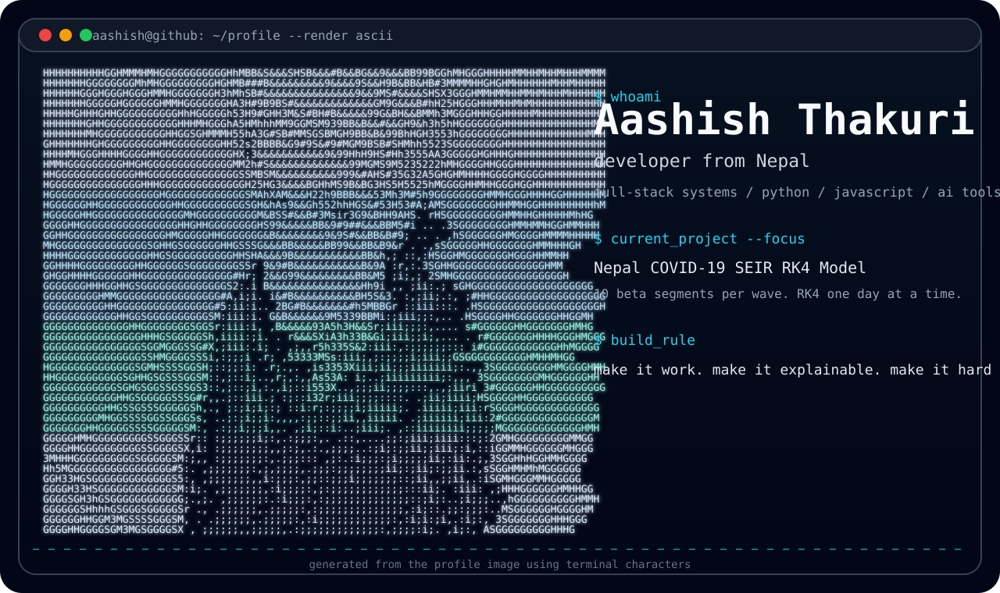

<div align="center">



</div>

```text
+------------------------------------------------------------------------------+
| aashish@github:~/profile                                                      |
+------------------------------------------------------------------------------+
| MODE        : build until the idea becomes real                               |
| LOCATION    : Nepal                                                           |
| STACK       : Python / JavaScript / React / FastAPI / MySQL                   |
| CURRENT     : SEIR RK4 simulation, data modelling, visual explanation         |
| PRINCIPLE   : make it work, make it explainable, make it hard to ignore       |
+------------------------------------------------------------------------------+
```

```text
$ cat ./identity.txt

I am Aashish Thakuri.
I build practical software, AI-assisted tools, data experiments, and visual
systems that make difficult ideas easier to defend.

I like code that behaves like a machine:
clear input, visible process, honest output.
```

```text
$ ls ./active-signal

Covid-19-SEIR-Model/
|-- two Nepal COVID-19 waves
|-- 10 fitted beta segments per wave
|-- SEIR differential equations
|-- RK4 numerical method
|-- beta reduction scenarios
`-- interactive teaching simulator
```

[Open the SEIR RK4 project](https://github.com/AashishThakuri/Covid-19-SEIR-Model)

```text
$ ./toolbelt --short

python       data work, modelling, automation
javascript   frontend logic and browser tools
react        usable interfaces
fastapi      backend APIs
mysql        structured storage
git          version control and clean delivery
```

```text
$ ./rules

01  start with the real problem
02  ship the smallest working system first
03  make every graph and README part of the product
04  explain the math like tomorrow is defense day
05  keep learning loudly, but commit cleanly
```

<div align="center">


</div>
