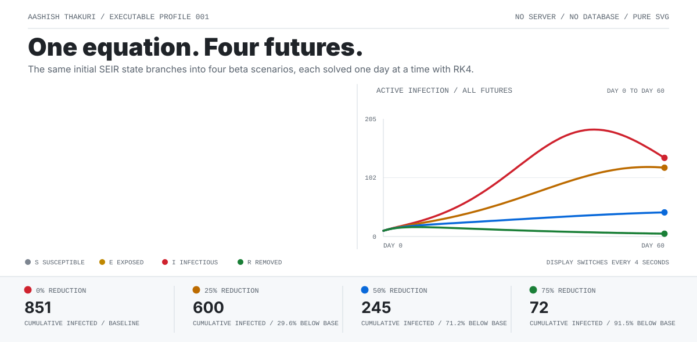

  

The population on the left automatically switches between four transmission scenarios. The graph keeps all four futures visible so the effect of reducing beta can be compared directly.

<strong>This is calculated, not decorative</strong>

The visual begins from one population of 1,000 people with the same initial S, E, I, and R values. Python creates four copies, applies a different beta to each copy, and advances every model for 60 days with the fourth-order Runge-Kutta method.

The generated SVG contains the actual compartment values and infection curves. It animates by itself inside GitHub without JavaScript, a server, a database, an external image service, or GitHub Actions. [Read the generator](./profile_lab.py).

## Aashish Thakuri

I build software that can be tested, inspected, and explained. My work moves between full-stack systems, data, numerical modelling, computer vision, and applied AI.

## Selected work

**[Covid-19-SEIR-Model](https://github.com/AashishThakuri/Covid-19-SEIR-Model)**

Two Nepal COVID-19 waves solved with RK4, ten fitted transmission segments per wave, validation against Johns Hopkins data, and intervention scenarios.

**[Hand Gesture Live Visuals](https://github.com/AashishThakuri/hand-gesture-live-visuals)**

A real-time OpenCV instrument with twelve visual effects controlled through MediaPipe hand tracking.

**[RiskLock](https://github.com/AashishThakuri/EsewaHackathon_TeamLyrical_ChallengeSix_Submission)**

Adaptive account recovery using device and behavior signals, Qwen3 with LoRA, FastAPI, React, Vite, and MySQL.

## Working set

`Python` `JavaScript` `TypeScript` `React` `FastAPI` `MySQL` `OpenCV` `MediaPipe` `NumPy` `Pandas` `SciPy`
