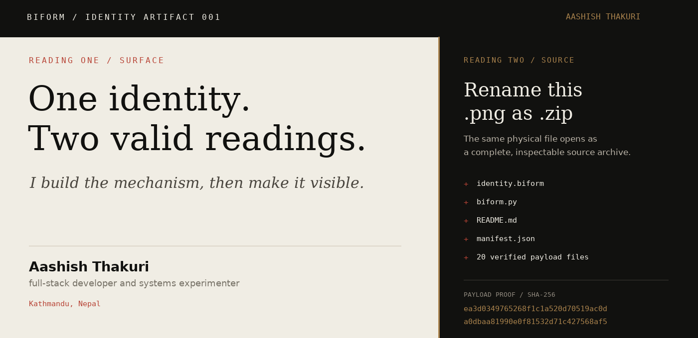
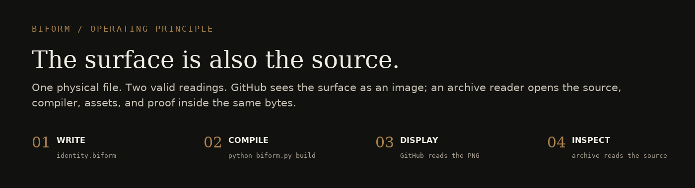
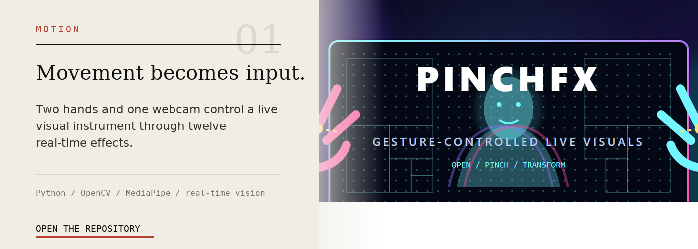
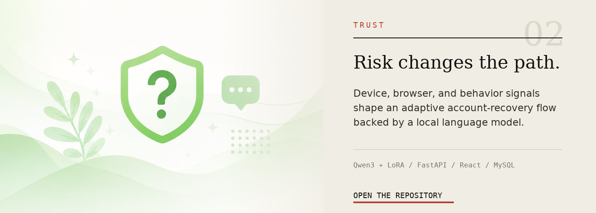
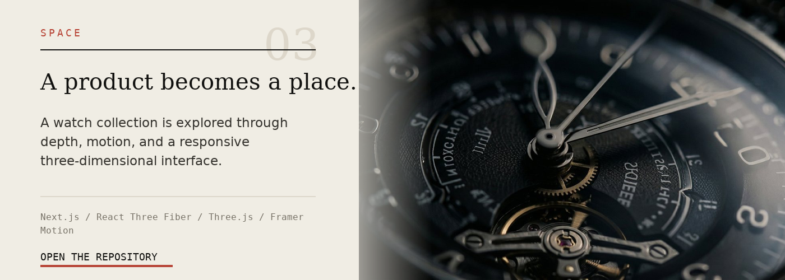
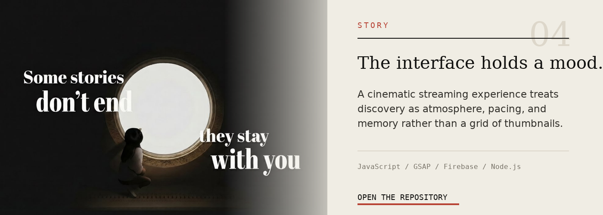

<p align="center">
  
</p>

<p align="center">
  <strong>This is not only a picture.</strong><br>
  The file above is simultaneously a GitHub-renderable PNG and an inspectable source archive.
</p>

<p align="center">
  <a href="https://raw.githubusercontent.com/AashishThakuri/AashishThakuri/main/assets/aashish.biform.png">Download the artifact</a>
  &nbsp;/&nbsp;
  <a href="./identity.biform">Read the identity source</a>
  &nbsp;/&nbsp;
  <a href="./assets/biform-manifest.json">Verify the payload</a>
</p>

## BIFORM

Most profile images hide how they were made. This one carries its construction inside itself. Rename `aashish.biform.png` to `aashish.biform.zip` and open it. The archive contains the identity source, compiler, visual sources, generated profile, and a SHA-256 proof manifest.

The image is the interface. The archive is the implementation. They are the same bytes.



## Selected Experiments

<a href="https://github.com/AashishThakuri/hand-gesture-live-visuals">
  
</a>
<a href="https://github.com/AashishThakuri/EsewaHackathon_TeamLyrical_ChallengeSix_Submission">
  
</a>
<a href="https://github.com/AashishThakuri/3D---Interactive-Watch-Vault-">
  
</a>
<a href="https://github.com/AashishThakuri/Streaming_Website_Resonance">
  
</a>

## Open The Other Reading

```powershell
Copy-Item assets/aashish.biform.png aashish.biform.zip
Expand-Archive aashish.biform.zip biform-profile
python biform-profile/biform.py verify --artifact aashish.biform.zip
```

`identity.biform` is the single human-edited source. `biform.py build` compiles the cover, project plates, README, manifest, and dual-valid artifact deterministically.

<p align="center">
  <sub>Kathmandu, Nepal / I build the mechanism, then make it visible.</sub>
</p>
