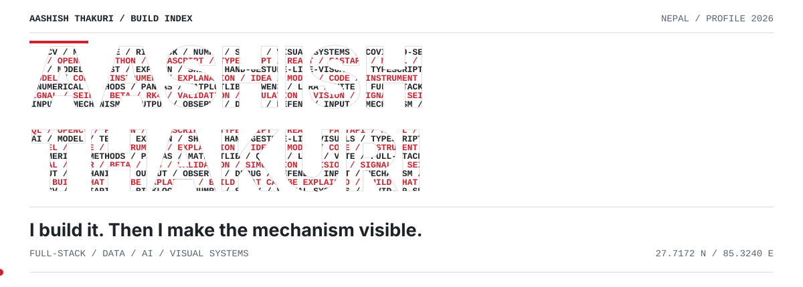

<p align="center">
  
</p>

I build software that can be opened, tested, and explained. Lately that means numerical disease models, computer-vision instruments, and risk-aware recovery systems.

## Selected work

### 01. [Covid-19-SEIR-Model](https://github.com/AashishThakuri/Covid-19-SEIR-Model)

Two Nepal COVID-19 waves simulated as initial-value problems. Ten time-varying transmission segments are fitted per wave, the SEIR equations are advanced with RK4, and intervention scenarios test how lower transmission changes predicted cases.

Python, NumPy, Pandas, SciPy, Matplotlib

### 02. [Hand Gesture Live Visuals](https://github.com/AashishThakuri/hand-gesture-live-visuals)

A real-time visual instrument where MediaPipe hand tracking controls twelve OpenCV effects. Movement becomes the interface.

Python, OpenCV, MediaPipe

### 03. [RiskLock](https://github.com/AashishThakuri/EsewaHackathon_TeamLyrical_ChallengeSix_Submission)

An adaptive account-recovery prototype that evaluates device and behavior signals before choosing which verification steps to open.

Qwen3 with LoRA, FastAPI, React, Vite, MySQL

## Working method

```text
unclear problem -> inspect the evidence -> model the mechanism
                -> build the system    -> test the result
                -> make it explainable
```

## Current tools

Python, JavaScript, TypeScript, React, FastAPI, MySQL, OpenCV, MediaPipe, NumPy, Pandas, SciPy
