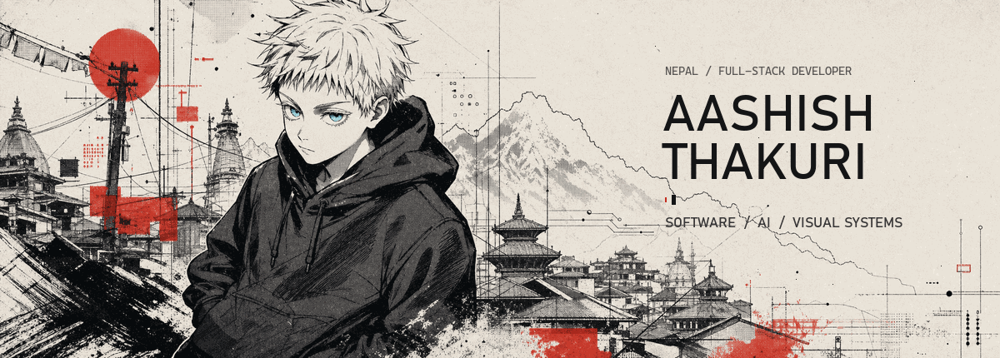

  

<h2 align="center">I build things that reveal how they work.</h2>

  Full-stack developer from Nepal working across software, AI, data, and visual systems. 
  I like ambitious ideas, visible mechanisms, and products that are easier to use than they were to build.

## What I Build

**Products with a complete spine** 
Interfaces, APIs, databases, and the decisions that connect them into one working system.

**Machines that can see and respond** 
Computer-vision experiments where movement, cameras, and real-time feedback become the interface.

**AI that earns its place** 
Applied models inside real workflows, with the surrounding product logic doing as much work as the model.

**Technical ideas made visible** 
Data, simulations, and interactive explanations that let people inspect the mechanism instead of trusting a black box.

## Selected Builds

### [Hand Gesture Live Visuals](https://github.com/AashishThakuri/hand-gesture-live-visuals)
A live visual instrument controlled by hand movement, built with Python, OpenCV, and MediaPipe.

### [RiskLock](https://github.com/AashishThakuri/EsewaHackathon_TeamLyrical_ChallengeSix_Submission)
An adaptive account-recovery system combining a full-stack product flow with AI-assisted risk decisions.

### [3D Interactive Watch Vault](https://github.com/AashishThakuri/3D---Interactive-Watch-Vault-)
A browser-based product experience exploring interaction, motion, and three-dimensional presentation.

## Working Language

`Python` `JavaScript` `TypeScript` `React` `FastAPI` `MySQL` `OpenCV` `MediaPipe` `NumPy` `Pandas`

  Made in Nepal. Built for anywhere.

