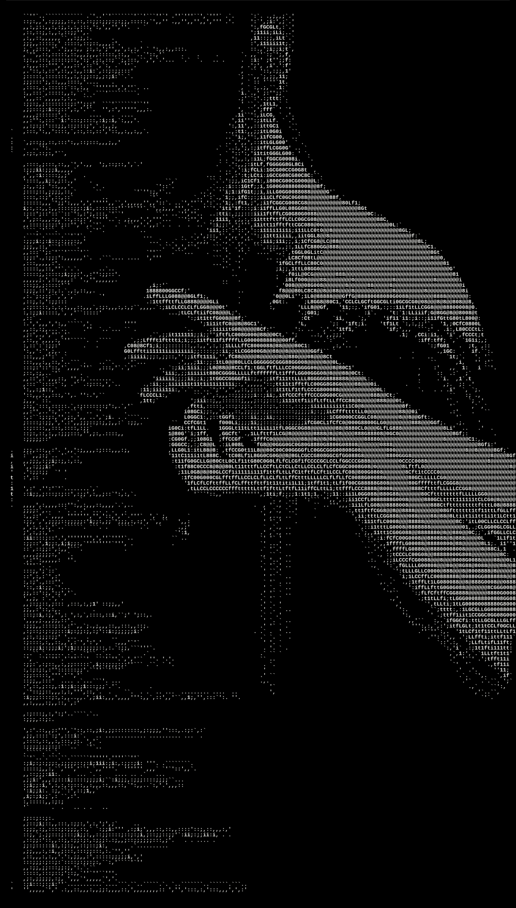
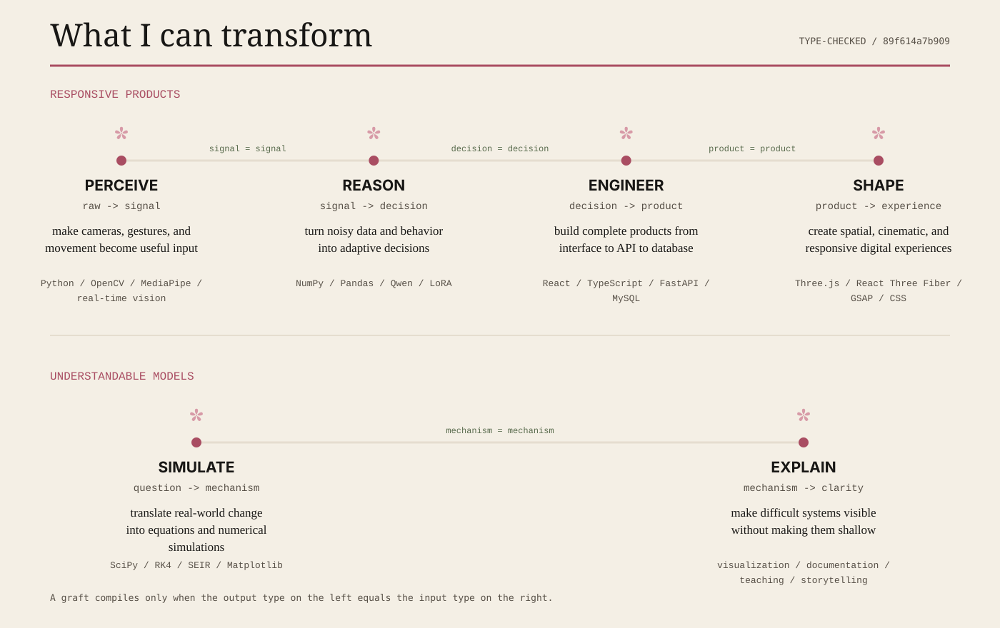

<p align="center">
  
</p>

<p align="center">
  <strong>This is not an embedded picture.</strong><br>
  Every visible mark is a terminal character.
</p>

## KSHAM/1

KSHAM is a small capability language created for this profile. It introduces semantic botany: source code is compiled as a living plant. A capability has an input type, an output type, an outcome, and the tools that make it possible. Capabilities compose with `|>` only when their types match.

The opening portrait is compiled from the supplied monochrome reference into 161 rows of real monospace text. Slow code streams and a decode scan move behind it while the reconstructed subject stays stable.



## What I Can Do

**PERCEIVE**<br>
I can make cameras, gestures, and movement become useful input.<br>
`Python` `OpenCV` `MediaPipe` `real-time vision`

**REASON**<br>
I can turn noisy data and behavior into adaptive decisions.<br>
`NumPy` `Pandas` `Qwen` `LoRA`

**ENGINEER**<br>
I can build complete products from interface to API to database.<br>
`React` `TypeScript` `FastAPI` `MySQL`

**SHAPE**<br>
I can create spatial, cinematic, and responsive digital experiences.<br>
`Three.js` `React Three Fiber` `GSAP` `CSS`

**SIMULATE**<br>
I can translate real-world change into equations and numerical simulations.<br>
`SciPy` `RK4` `SEIR` `Matplotlib`

**EXPLAIN**<br>
I can make difficult systems visible without making them shallow.<br>
`visualization` `documentation` `teaching` `storytelling`

## The Language

```ksham
capability perceive: raw -> signal {
  can "make cameras, gestures, and movement become useful input"
  using ["Python", "OpenCV", "MediaPipe", "real-time vision"]
}

compose perceive |> reason |> engineer |> shape as "responsive products"
compose simulate |> explain as "understandable models"
```

The first composition means I can take raw human or camera input, turn it into a signal, reason over it, engineer a complete product, and shape that product into an experience. The second means I can turn a real-world question into a numerical mechanism and then make that mechanism understandable.

## Compile The Profile

```powershell
python ksham.py check
python ksham.py build
python ksham.py test
```

The human-edited source is [`profile.ksham`](./profile.ksham). The lexer, parser, semantic checker, composition type system, cherry-blossom animation, capability map, and README compiler are implemented in [`ksham.py`](./ksham.py) using only the Python standard library.

<p align="center">
  <sub>Kathmandu, Nepal / I turn raw reality into systems people can see, use, and understand.</sub>
</p>
