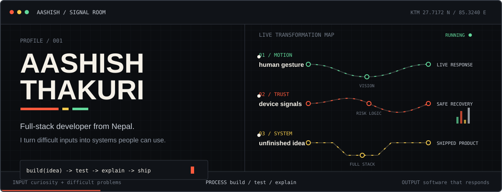

  

I build software that turns difficult inputs into clear responses. Pick a signal below and follow it to the code.

## Enter The Signal Room

<strong>01 / MOTION TO RESPONSE</strong>

### [Hand Gesture Live Visuals](https://github.com/AashishThakuri/hand-gesture-live-visuals)

Twelve real-time visual effects controlled through hand movement. The camera becomes the input device.

`Python` `OpenCV` `MediaPipe`

<strong>02 / SIGNALS TO TRUST</strong>

### [RiskLock](https://github.com/AashishThakuri/EsewaHackathon_TeamLyrical_ChallengeSix_Submission)

Adaptive account recovery that turns device and behavior signals into the right verification path.

`FastAPI` `React` `MySQL` `Applied AI`

<strong>03 / IDEA TO SYSTEM</strong>

I build complete products across interface, API, data, and interaction. The stack changes; the rule does not: make the mechanism understandable and the experience simple.

`Python` `JavaScript` `TypeScript` `React` `FastAPI` `Computer Vision` `Data`

  Kathmandu, Nepal / building for anywhere

<!--
You found the quiet channel.

The visible interface is only the surface.
The source is where the decisions live.

https://github.com/AashishThakuri?tab=repositories&type=source
-->
