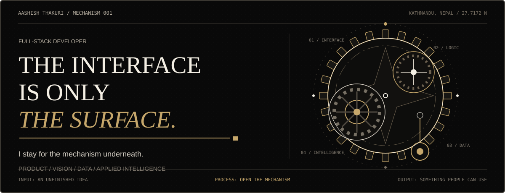

  

I am a full-stack developer from Nepal. I build the parts people touch and the mechanisms they never have to think about.

## Selected Mechanisms

**[Motion becomes input](https://github.com/AashishThakuri/hand-gesture-live-visuals)** 
Hand tracking controls a live visual instrument through twelve real-time effects.

**[Signals become trust](https://github.com/AashishThakuri/EsewaHackathon_TeamLyrical_ChallengeSix_Submission)** 
Device and behavior signals shape an adaptive account-recovery path.

**[Objects become experiences](https://github.com/AashishThakuri/3D---Interactive-Watch-Vault-)** 
A product is explored through motion, depth, and three-dimensional interaction.

## Materials

`Python` `JavaScript` `TypeScript` `React` `FastAPI` `MySQL` `OpenCV` `MediaPipe`

  Kathmandu, Nepal / curious about what moves underneath

<!--
The interface ended. You kept looking.

That is the whole idea.

https://github.com/AashishThakuri?tab=repositories&type=source
-->
