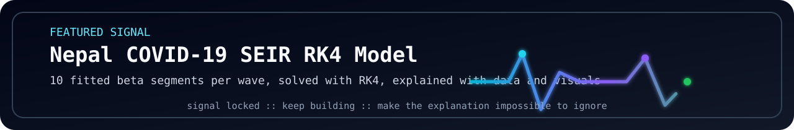

<div align="center">



<pre>
+------------------------------------------------------------------------------+
|                                                                              |
|     A A S H I S H   T H A K U R I                                           |
|                                                                              |
|     full-stack developer        ai curious builder        nepal based         |
|                                                                              |
|     code is not decoration. it is a working machine with a pulse.             |
|                                                                              |
+------------------------------------------------------------------------------+
</pre>


</div>

## Signal

```text
input  : messy idea, half-built repo, impossible deadline
process: understand -> design -> code -> debug -> explain
output : clean system, working demo, readable story
```

I am Aashish Thakuri, a developer from Nepal who likes building systems that feel alive but stay understandable. I work around full-stack development, Python, JavaScript, AI tools, data projects, and visual explanations that make hard topics less painful to defend.

## Control Room

| Channel | Current Frequency |
|---|---|
| Main stack | Python, JavaScript, React, FastAPI, MySQL |
| Strong interest | AI systems, data modelling, developer tools |
| Recent work | SEIR RK4 COVID-19 simulation for Nepal |
| Build style | Practical first, visual second, explanation always |
| Operating mode | Learn fast, ship clean, make it defendable |

## Featured Experiment

<div align="center">



</div>

```text
project : Nepal COVID-19 SEIR RK4 Model
method  : 10 fitted beta segments per wave
solver  : fourth-order Runge-Kutta
result  : model curve, beta table, reduction scenarios, teaching simulator
repo    : github.com/AashishThakuri/Covid-19-SEIR-Model
```

The project turns COVID-19 time-series data into a two-wave SEIR simulation. Instead of using one beta for the whole wave, each wave is divided into 10 date segments and one beta value is fitted for each segment. RK4 then moves the model forward one day at a time.

[Open The SEIR RK4 Repository](https://github.com/AashishThakuri/Covid-19-SEIR-Model)

## Toolkit

<table align="center">
  <tr>
    <td align="center" width="120"><br>Python</td>
    <td align="center" width="120"><br>JavaScript</td>
    <td align="center" width="120"><br>React</td>
    <td align="center" width="120"><br>FastAPI</td>
    <td align="center" width="120"><br>MySQL</td>
    <td align="center" width="120"><br>Git</td>
  </tr>
  <tr>
    <td align="center" width="120"><br>Docker</td>
    <td align="center" width="120"><br>Linux</td>
    <td align="center" width="120"><br>HTML</td>
    <td align="center" width="120"><br>CSS</td>
    <td align="center" width="120"><br>Vite</td>
    <td align="center" width="120"><br>GitHub</td>
  </tr>
</table>

## Build Philosophy

```text
01. Start with the real problem.
02. Make the system work before making it loud.
03. Make the explanation as strong as the code.
04. Treat every graph, README, and demo as part of the product.
05. Leave the next person less confused than before.
```

## Live Panels

<div align="center">


</div>

## Contact

<div align="center">

[](https://github.com/AashishThakuri)
[](https://github.com/AashishThakuri/Covid-19-SEIR-Model)

</div>

<pre align="center">
              system status: still learning, still building, still restless enough to improve
</pre>
