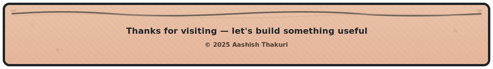

  

### ⚡ I'm Aashish Thakuri

*"I believe great software isn't just about solving problems—it's about creating experiences that feel like magic while remaining invisible in their complexity."*

I'm a passionate Full-Stack Developer from Nepal who loves to play with AI tools and is eager to learn theoretically about artificial intelligence. I enjoy coding, writing, and turning complex problems into elegant solutions that make technology feel effortless.

  
  
  

---

### 💻 Tech Stack

<table align="center" style="border:3px solid #30363d;border-radius:12px;background:#0d1117;padding:8px">
  <tr>
    <td align="center" width="96">
      
       Python
    </td>
    <td align="center" width="96">
      
       JavaScript
    </td>
    <td align="center" width="96">
      
       AWS
    </td>
    <td align="center" width="96">
      
       Docker
    </td>
    <td align="center" width="96">
      
       Kubernetes
    </td>
    <td align="center" width="96">
      
       GitHub
    </td>
  </tr>
  <tr>
    <td align="center" width="96">
      
       React
    </td>
    <td align="center" width="96">
      
       REST API
    </td>
    <td align="center" width="96">
      
       Nginx
    </td>
    <td align="center" width="96">
      
       MySQL
    </td>
    <td align="center" width="96">
      
       TypeScript
    </td>
    <td align="center" width="96">
      
       C#
    </td>
  </tr>
 </table>

---

### 🚀 Interactive Code Matrix

### 🎯 Dynamic Developer Metrics

---

